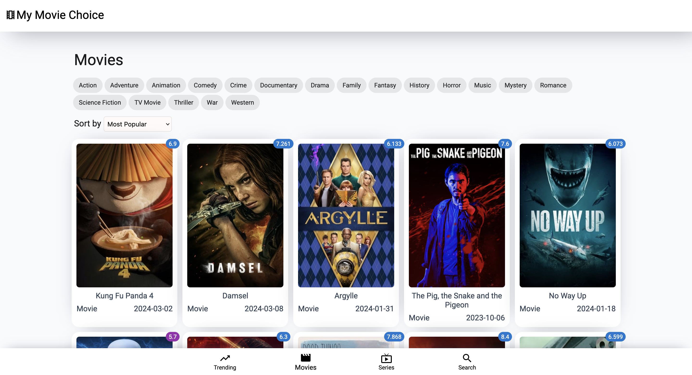
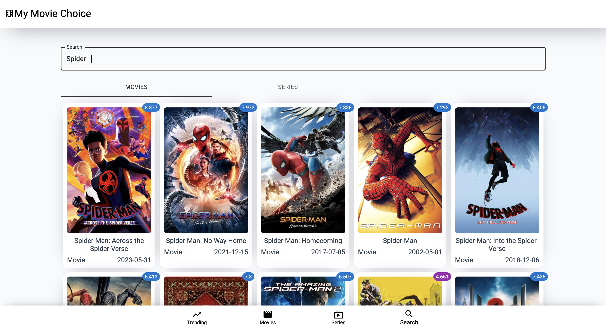

# My Movie Choice🍿

The movie tracking app, which can help people decide what movie to watch. 


## Tech Stack

**Client:** React(Hooks), React-Router, Material UI, React-Query


## Screenshots






## Run Locally

Clone the project

```bash
  git clone https://github.com/thatsfov1/my-movie-choice.git
```

Go to the project directory

```bash
  cd my-movie-choice
```

Install dependencies

```bash
  npm install
```


## FAQ

#### How long has it been in development?

Development took about a week

